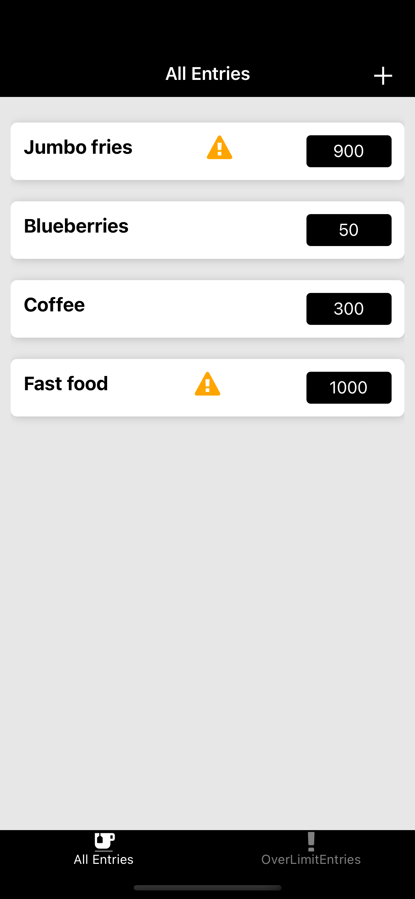
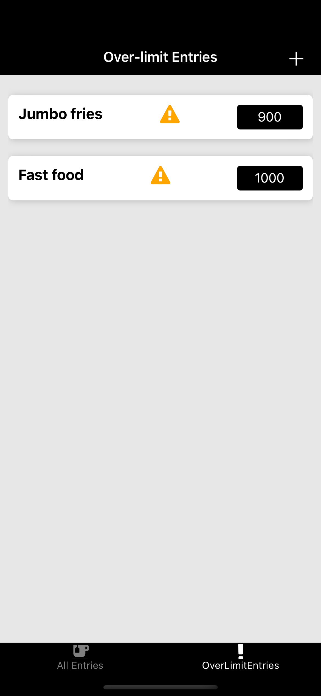
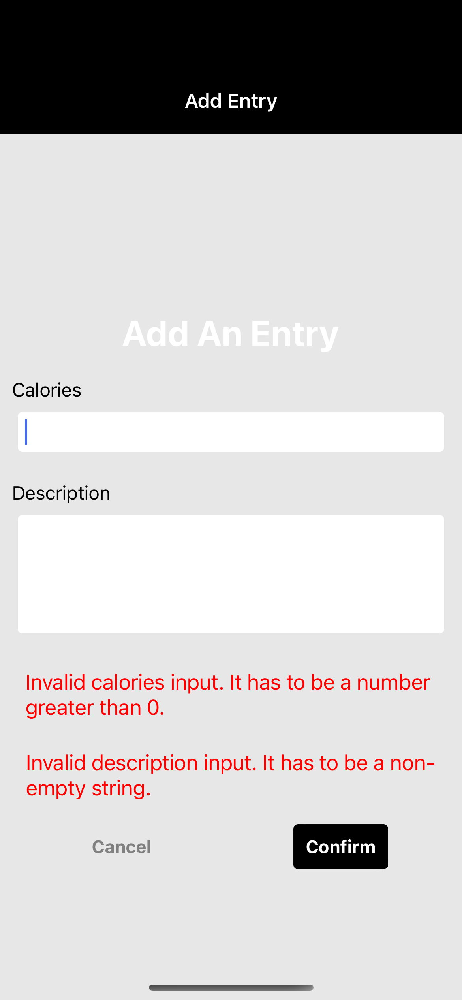
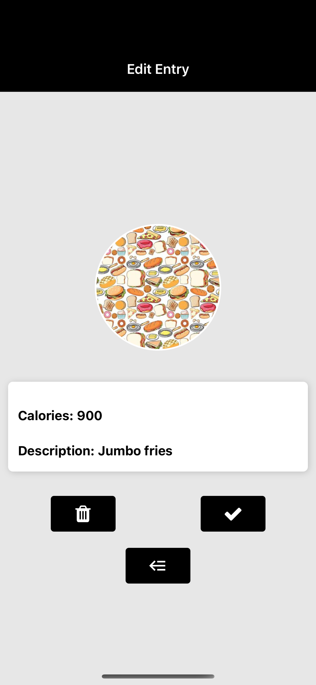
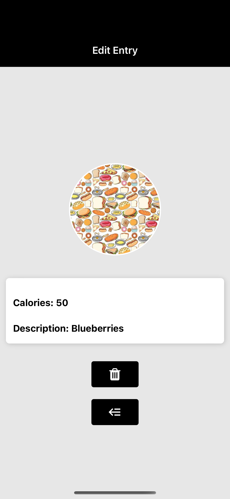
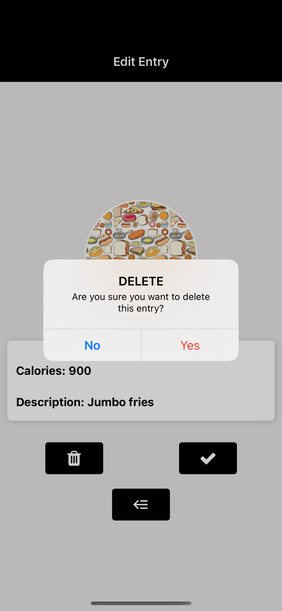
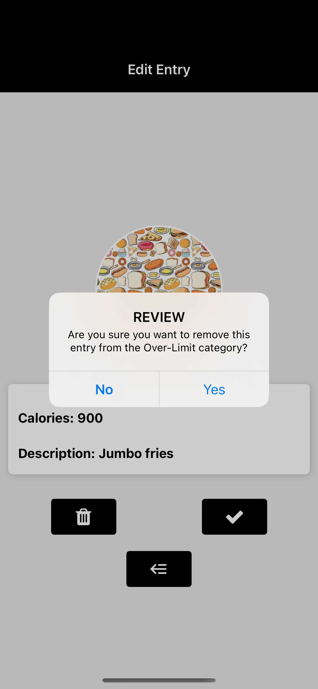

# Calorie Tracker App

## Overview

This is a mobile app build with React Native front-end and Google Firebase backend. This app can perform CRUD operations.abs

## Screens

### Home Screen




If no entries are found, there will be lines of text indicating it.

### Add Screen



When the user taps the + sign on the top right corner of the home screen, they will be able to add an entry. The current Over-Limit standard is 300.

### Edit Screen




The edit screen will show up when you tap on the entry in the list format. If the entry is over-limit, the user can review the entry and remove it from the overlimit category. This process cannot be reversed.




2-3 operations can be performed on the edit screen:

1. Delete the entry and go back to home screen. The user will be asked to confirm their decision.
2. (Over-limit only) Review the entry and go back to home screen. The user will be asked to confirm their decision.
3. Go back to previous screen.

## Usage

```{bash}
cd calorie-tracker
npx expo start
```
